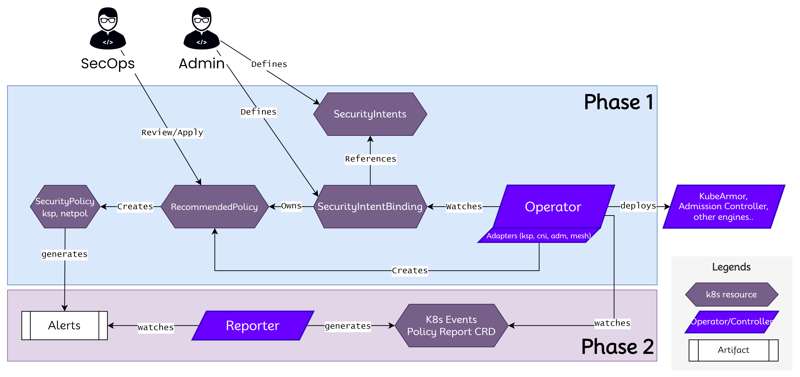

# Nimbus: Intent Driven Security Operator

> The aim for any organization should be to state its security
> goal/intents and the underlying tooling/operator should be able to convert
> these goals/intents into actionable elements such as policies/rules.

Nimbus aims to decouple security intents from its actual implementation i.e.,
use of policy engines and corresponding policies and rules. This pattern exists
commonly in Kubernetes world and the best example is a storage operator,
wherein the user specifies the persistent volume claims with appropriate SLA
(disk space, R/W, speed) and the operator figures out the appropriate volume to
bind. Nimbus intends to bring in similar abstraction for security intents
wherein the user specifies the security intent and the operator figures out the
best implementation method available given the deployment.

* An Intent might get translated into a set of policies and not necessarily a
  single policy thus providing multi-layer defense. For example, an intent such
  as "Do not allow privilege escalation" could get translated in to admission
  controller policy and system policy as handled by runtime security engines
  such as [KubeArmor](https://www.kubearmor.io).
* An intent could take into consideration runtime behavior and then handle
  intent implementation. For e.g., an intent could be "Do not allow privilege
  flags for pods that are publicly reachable".
* An intent might get fully or partially satisfied and the bindings clearly
  shows that status.
* An organization can provide a blueprint of intents given a deployment and the
  operator could go an try to satisfy those intents in best-effort or strict mode.

* [Getting Started](docs/getting-started.md)
* [Quick Tutorials](docs/quick-tutorials.md)

# Credits

This project is funded by NSF grant ...
