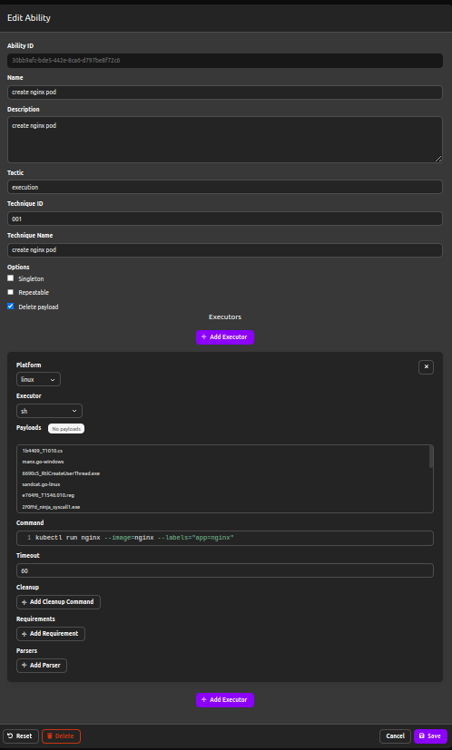
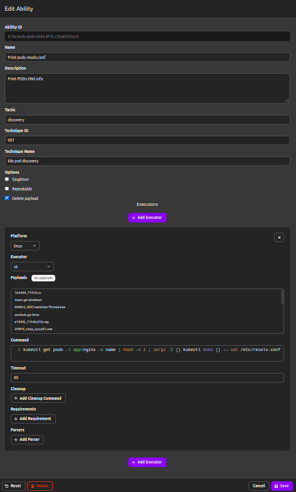
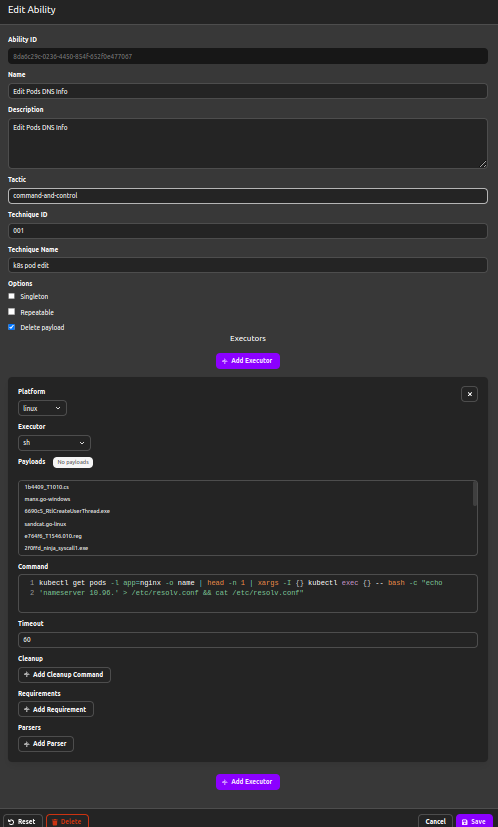
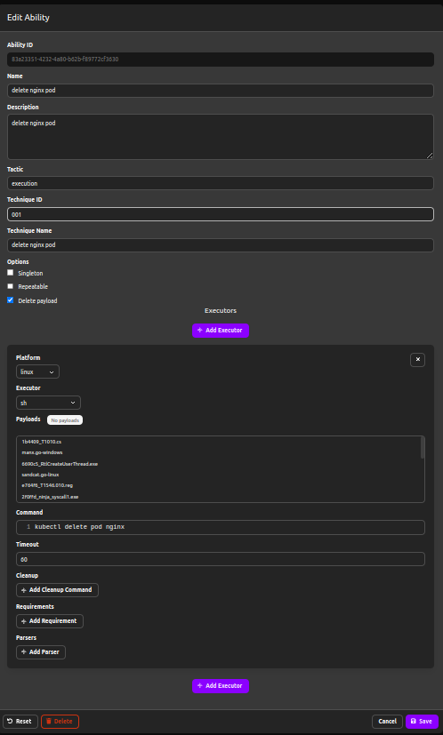
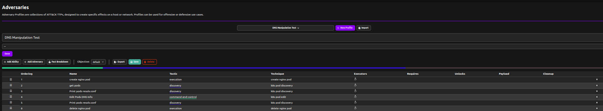
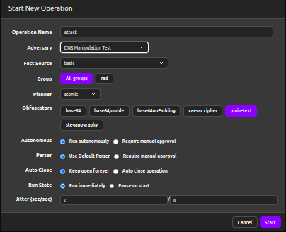
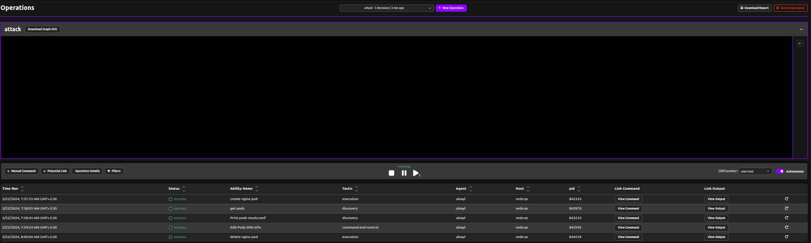

## Defining Abilities

Since dns-manipulation doesn't pre-exist in caldera abilities so we need to define the abilities by ourselves.

### Create abilities

Commands


```bash
kubectl run nginx --image=nginx --labels="app=nginx"
```

```bash
kubectl get pods -l app=nginx -o name | head -n 1 | xargs -I {} kubectl exec {} -- cat /etc/resolv.conf
```

```bash
kubectl get pods -l app=nginx -o name | head -n 1 | xargs -I {} kubectl exec {} -- bash -c "echo 'nameserver 10.96.' > /etc/resolv.conf && cat /etc/resolv.conf"
```

```bash
kubectl delete pod nginx
```

### Create nginx pod



### Print pod's resolv.conf



### Edit pod's DNS info



### Delete nginx pod




## Create Adversary

- `+` New Profile
- `+` Add Ability



## Create Operation

- `+` New Operation
- set Adversary




## Attack Emulation

After creating the operation click on start to start the attack, optionally you can also check locally in your terminal that whether the caldera agent is working as expected or not.




## Mitigation

For the mitigation of `DNS-Manipulation` we need nimbus-kubearmor adapter to be in-place:
- First we need to install nimbus, you can do so by following the steps over [here](../../docs/getting-started.md#nimbus).
- Now you can follow the guide [here](../../docs/getting-started.md#nimbus-kubearmor) to install nimbus-kubearmor adapter.
- Now apply the dns-manipulation intent in your cluster as defined [here](../../examples/namespaced/dns-manipulation-si-sib.yaml) and then try to re-run the attack, you'll see that now the agent will not be able to modify the resolv.conf. Resulting the failure in step-4 as defined above.