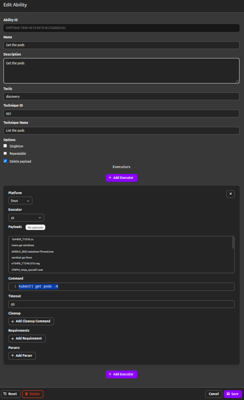
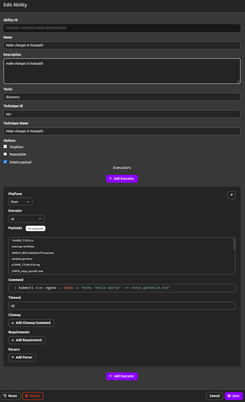
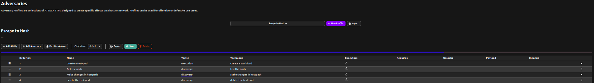
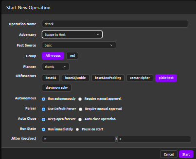
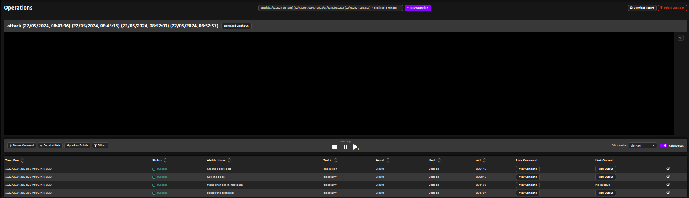

## Defining Abilities

Since dns-manipulation doesn't pre-exist in caldera abilities so we need to define the abilities by ourselves.

### Create abilities

Commands


```bash
kubectl create -f https://raw.githubusercontent.com/5GSEC/nimbus/main/attack-emulation/escape-to-host/pod.yaml
```

```bash
kubectl get pods nginx 
```

```bash
kubectl exec nginx -- bash -c "echo 'hello world!' >> /test-pd/hello.txt"
```

```bash
kubectl delete pod nginx
```

### Create test pod


### Get the pod



### Make changes in hostpath



### Delete test pod


## Create Adversary

- `+` New Profile
- `+` Add Ability



## Create Operation

- `+` New Operation
- set Adversary




## Attack Emulation

After creating the operation click on start to start the attack, optionally you can also check locally in your terminal that whether the caldera agent is working as expected or not.




## Mitigation

For the mitigation of `Escape-to-host` we need nimbus-kyverno adapter to be in-place:
- First we need to install nimbus, you can do so by following the steps over [here](../../docs/getting-started.md#nimbus).
- Now you can follow the guide [here](../../docs/getting-started.md#nimbus-kyverno) to install nimbus-kyverno adapter.
- Now apply the escape-host-intent in your cluster as defined [here](../../examples/clusterscoped/escape-to-host-si-sib.yaml) and then try to re-run the attack, you'll see that now the agent will not be able to create a vulnerable pod. Resulting the failure in step-1 as defined above.