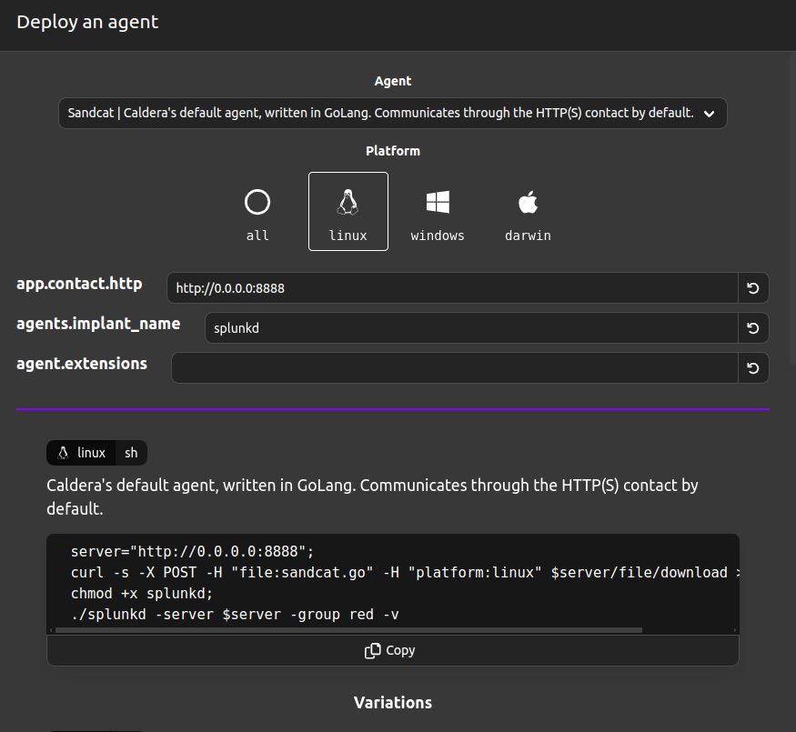
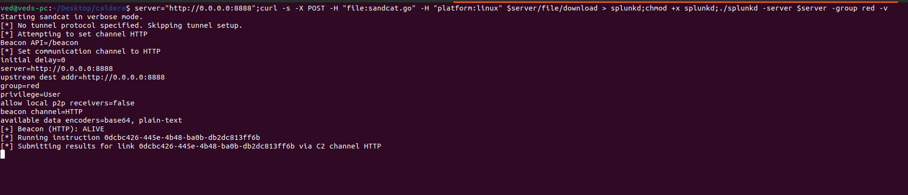

# Caldera Installation Guide

Before going to emulate the attack and mitigation, we need to install caldera in out local system.

## Prerequisites

Before installing Caldera, ensure you have the following prerequisites:

1. **Operating System**: 
   - Linux (Ubuntu 18.04+ recommended)
   - macOS (10.15+)
   - Windows 10 (WSL recommended for Windows users)

2. **Python**: Python 3.8 or higher. Ensure you have Python installed by running:
   ```bash
   python3 --version
   ```
   If Python is not installed, download it from [python.org](https://www.python.org/downloads/).

3. **Git**: Git version control system. Verify installation by running:
   ```bash
   git --version
   ```
   If Git is not installed, download it from [git-scm.com](https://git-scm.com/downloads).

4. **Docker** (optional but recommended for easier setup and environment management). Verify installation by running:
   ```bash
   docker --version
   ```
   If Docker is not installed, download it from [docker.com](https://www.docker.com/get-started).

5. **pip**: Python package installer. Ensure you have pip installed by running:
   ```bash
   pip3 --version
   ```
   If pip is not installed, you can install it using:
   ```bash
   sudo apt-get install python3-pip
   ```

## Installation Steps

Follow these steps to install and set up Caldera:

1. **Clone the Caldera Repository**:
   ```bash
   git clone https://github.com/mitre/caldera.git --recursive
   cd caldera
   ```

2. **Create a Virtual Environment** (recommended):
   ```bash
   python3 -m venv caldera_env
   . caldera_env/bin/activate
   ```

3. **Install Python Dependencies**:
   ```bash
   pip install -r requirements.txt
   ```

4. **Configure Caldera**:
   - Rename the example configuration file:
     ```bash
     mv conf/default.yml.example conf/default.yml
     ```
   - Edit `conf/default.yml` to customize your settings if necessary.

5. **Database Setup** (if using the default SQLite database, you can skip this step):
   - For MongoDB or other databases, update `conf/default.yml` with your database connection details.

6. **Start Caldera**:
   - For Linux/macOS:
     ```bash
     python3 server.py --insecure --build
     ```
   - For Windows:
     ```bash
     python3.exe server.py --insecure --build
     ```

   Caldera should now be running. By default, it will be accessible at `http://localhost:8888`.

7. **Access the Web Interface**:
   Open your web browser and navigate to `http://localhost:8888`. The default login credentials are:
   - **Username**: `red`
   - **Password**: `admin`

## Optional: Running Caldera with Docker

If you prefer to use Docker, follow these steps:

1. **Pull the Docker Image**:
   ```bash
   docker pull mitre/caldera
   ```

2. **Run the Docker Container**:
   ```bash
   docker run -d -p 8888:8888 --name caldera mitre/caldera
   ```

3. **Access the Web Interface**:
   Open your web browser and navigate to `http://localhost:8888`. Use the default credentials to log in.


## Deploying Agent

agents -> Deploy an agent -> choose sandcat, linux
app.contact.http : http://<external IP or domain>:8888
agents.implant_name : Installing file name on victim cluster



Copy the given script open a new terminal and run the script, to deploy the caldera agent




Now we're good to go ahead and playalong with some attack emulation eg: dns-manipulation, escape-to-host

## Troubleshooting

If you encounter any issues during installation or setup, consider the following steps:

- **Check Dependencies**: Ensure all prerequisites are installed and up to date.
- **Review Configuration Files**: Double-check `conf/default.yml` for any misconfigurations.
- **Consult the Documentation**: Refer to the [official Caldera documentation](https://caldera.readthedocs.io/en/latest/) for more detailed information.

For further assistance, you can open an issue on the [Caldera GitHub repository](https://github.com/mitre/caldera/issues).

---
