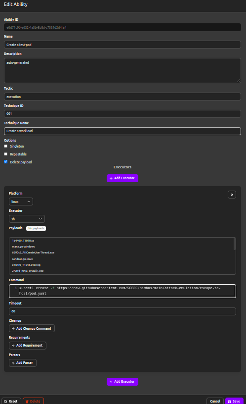
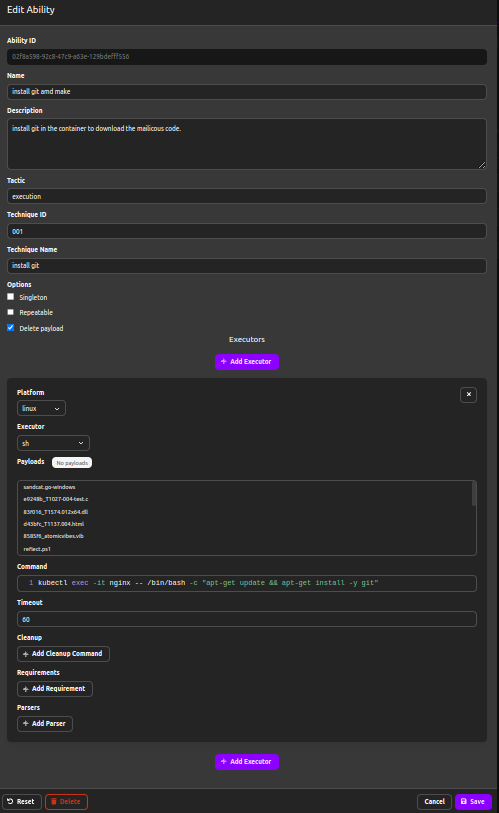
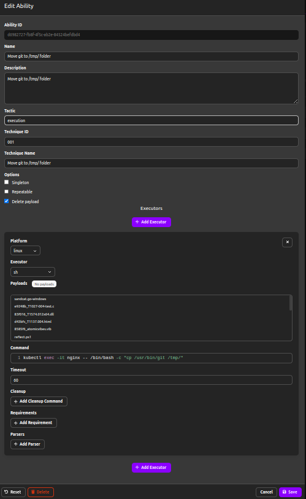
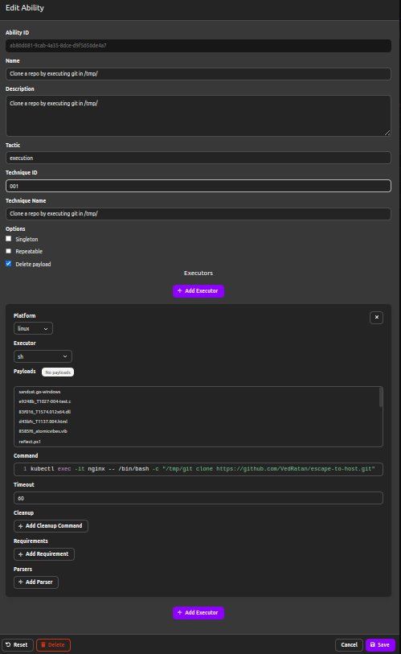
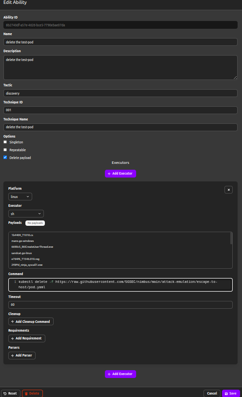
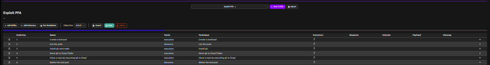
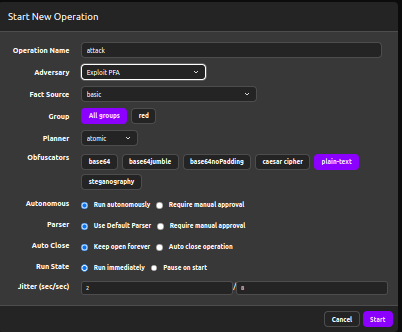
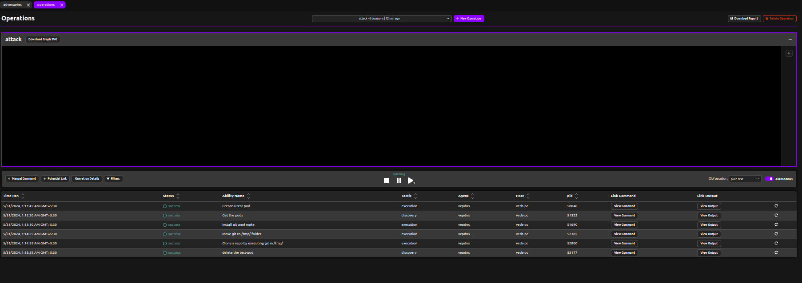

## Defining Abilities

Since exploit-pfa doesn't pre-exist in caldera abilities so we need to define the abilities by ourselves.

### Create abilities

Commands


```bash
kubectl create -f https://raw.githubusercontent.com/5GSEC/nimbus/main/docs/attack-emulation/pod.yaml
```

```bash
kubectl get pods nginx 
```

```bash
kubectl exec -it nginx -- /bin/bash -c "apt-get update && apt-get install -y git"
```

```bash
kubectl exec -it nginx -- /bin/bash -c "cp /usr/bin/git /tmp/"
```

```bash
kubectl exec -it nginx -- /bin/bash -c "/tmp/git clone https://github.com/thockin/test.git"
```

```bash
kubectl delete pod nginx
```

### Create test pod



### Get the pod


### Install git



### Move git binary



## Clone a github repo



## Delete the test pod



## Create Adversary

- `+` New Profile
- `+` Add Ability



## Create Operation

- `+` New Operation
- set Adversary




## Attack Emulation

After creating the operation click on start to start the attack, optionally you can also check locally in your terminal that whether the caldera agent is working as expected or not.




## Mitigation

For the mitigation of `Exploit-PFA` we need nimbus-kuberamor adapter to be in-place:
- First we need to install nimbus, you can do so by following the steps over [here](../../docs/getting-started.md#nimbus).
- Now you can follow the guide [here](../../docs/getting-started.md#nimbus-kubearmor) to install nimbus-kubearmor adapter.
- Now apply the escape-host-intent in your cluster as defined [here](../../examples/namespaced/exploit-pfa-si