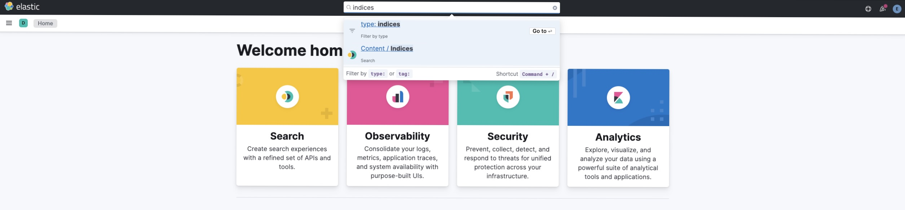
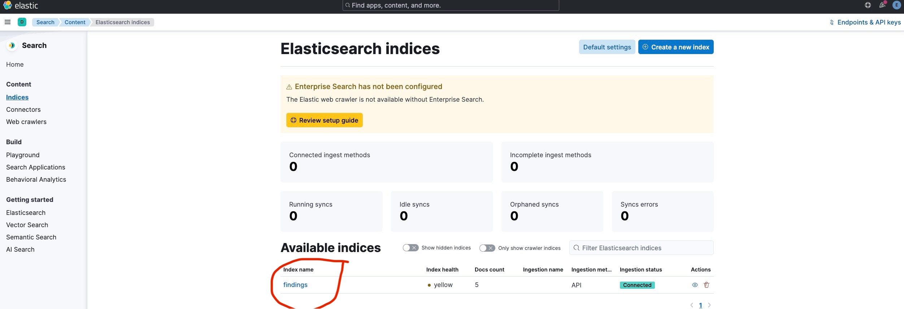
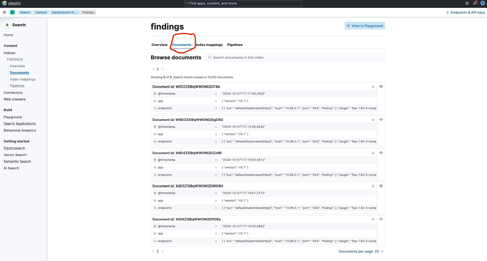
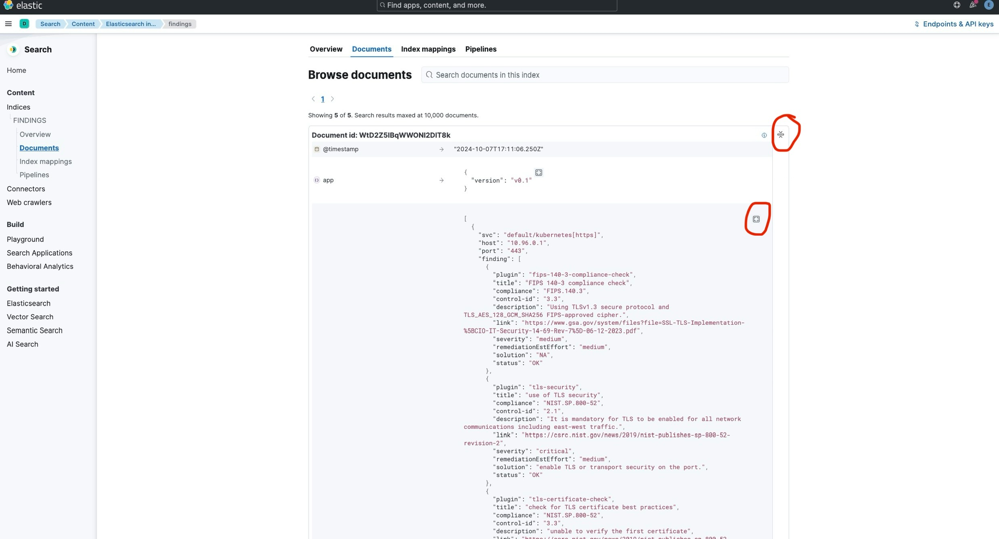

# Objective

**Attack vectors**: An attacker who controls an external Application Function (AF) could potentially present a
fraudulent OAuth access token to gain unauthorized access to Network Exposure Function (NEF) services. This highlights
the importance of securing communication channels within your network.

**Mitigation**: The `Assess TLS` `SecurityIntent` focuses on mitigating this risk by assessing the TLS configuration of
your resources in all namespaces. This includes verifying aspects like:

- TLS protocol version
- Certificate validity
- Cipher suite compliance with FIPS-140-3 standards

## Tutorial

### Prerequisites

**Nimbus suite**: Follow [this](../../deployments/nimbus/Readme.md) guide to install complete suite.

#### 1. Create a SecurityIntent and ClusterSecurityIntentBinding:

```shell
cat <<EOF | kubectl apply -f -
apiVersion: intent.security.nimbus.com/v1alpha1
kind: SecurityIntent
metadata:
  name: assess-tls-default
  annotations:
    intent.security.nimbus.com/title: Assess TLS configurations
    # Severity should be a standard threat severity level (e.g., Low, Medium, High, Critical)
    intent.security.nimbus.com/severity: Medium
    # Description should clearly explain the intent and its security implications
    intent.security.nimbus.com/description: |
      This SecurityIntent assesses the TLS configuration of your resources to 
      ensure compliance with security standards. It verifies TLS protocol version,
      certificate validity, and FIPS-140-3 approved cipher suites.
spec:
spec:
  intent:
    id: assessTLS
    action: Audit # Block action has no effect here
---
apiVersion: intent.security.nimbus.com/v1alpha1
kind: ClusterSecurityIntentBinding
metadata:
  name: assess-tls-default
spec:
  intents:
    - name: assess-tls-default
  selector:
    nsSelector: # Selects all namespaces by default
      matchNames:
        - '*'
EOF
```

#### 2. Verifying Resources creation:

After applying the `SecurityIntent` and `ClusterSecurityIntentBinding`, use the following commands to verify creation of
resources:

```shell
# Check SecurityIntent, and ClusterSecurityIntentBinding creation
$ kubectl get si,csib
NAME                                                           STATUS    AGE
securityintent.intent.security.nimbus.com/assess-tls-default   Created   76s

NAME                                                                         STATUS    AGE   INTENTS   NIMBUSPOLICIES   CLUSTERNIMBUSPOLICY
clustersecurityintentbinding.intent.security.nimbus.com/assess-tls-default   Created   77s   1         11               assess-tls-default

# Check ClusterNimbusPolicy creation for the ClusterSecurityIntentBinding
$ kubectl get cwnp assess-tls-default
NAME                 STATUS    AGE     POLICIES
assess-tls-default   Created   2m27s   1

# Check details of the ClusterNimbusPolicy to know about actual policies
$ kubectl describe cwnp assess-tls-default
Name:         assess-tls-default
...
# Fields omitted for brevity
...
Status:
  Adapter Policies:
    nimbus-k8tls-env/CronJob/assess-tls-default-assesstls
  Last Updated:                2024-10-07T15:36:57Z
  Number Of Adapter Policies:  1
  Status:                      Created
Events:                        <none>
```

This SecurityIntent triggers a periodically scheduled CronJob within the `nimbus-k8tls-env` namespace. This CronJob is
responsible for running the TLS assessment.

#### 3. Validation:

```shell
$ kubectl -n nimbus-k8tls-env get cj
NAME                           SCHEDULE   TIMEZONE   SUSPEND   ACTIVE   LAST SCHEDULE   AGE
assess-tls-default-assesstls   @weekly    <none>     False     0        <none>          8m22s
```

> [!Note]: By default, the CronJob runs weekly. You can adjust the schedule using the `schedule` parameter in the
> SecurityIntent definition. Refer to this [example](../../examples/clusterscoped/assesstls-with-schedule.yaml).

If the `SecurityIntent` and its policy are working correctly, you should see a `CronJob` in `nimbus-k8tls-env`
namespace.

#### 4. Assessment Report:

- By default, this `CronJob` logs its assessment report to `STDOUT`. You can access these
  logs using `kubectl logs` command from the specific CronJob's pod.

<details>

```shell
$ kubectl -n nimbus-k8tls-env logs <pod_name> -c k8tls
unsupported protocol UDP
checking [10.96.0.1:443 default/kubernetes[https]]...
	executing [k8tls_tls_00chktls] tool=tls...
	executing [k8tls_tls_01checkversion] tool=tls...
	executing [k8tls_tls_02certificateChecks] tool=tls...
checking [10.99.11.127:5000 default/web-server-service]...
	executing [k8tls_tls_00chktls] tool=tls...
	executing [k8tls_tls_01checkversion] tool=tls...
	executing [k8tls_tls_02certificateChecks] tool=tls...
checking [10.108.204.179:80 ingress-nginx/ingress-nginx-controller[http]]...
	executing [k8tls_tls_00chktls] tool=tls...
	executing [k8tls_tls_01checkversion] tool=tls...
	executing [k8tls_tls_02certificateChecks] tool=tls...
checking [10.108.204.179:443 ingress-nginx/ingress-nginx-controller[https]]...
	executing [k8tls_tls_00chktls] tool=tls...
	executing [k8tls_tls_01checkversion] tool=tls...
	executing [k8tls_tls_02certificateChecks] tool=tls...
checking [10.97.149.132:443 ingress-nginx/ingress-nginx-controller-admission[https-webhook]]...
	executing [k8tls_tls_00chktls] tool=tls...
	executing [k8tls_tls_01checkversion] tool=tls...
	executing [k8tls_tls_02certificateChecks] tool=tls...
checking [10.96.0.10:53 kube-system/kube-dns[dns-tcp]]...
	executing [k8tls_tls_00chktls] tool=tls...
	executing [k8tls_tls_01checkversion] tool=tls...
	executing [k8tls_tls_02certificateChecks] tool=tls...
checking [10.96.0.10:9153 kube-system/kube-dns[metrics]]...
	executing [k8tls_tls_00chktls] tool=tls...
	executing [k8tls_tls_01checkversion] tool=tls...
	executing [k8tls_tls_02certificateChecks] tool=tls...
checking [10.111.234.163:443 kube-system/metrics-server[https]]...
	executing [k8tls_tls_00chktls] tool=tls...
	executing [k8tls_tls_01checkversion] tool=tls...
	executing [k8tls_tls_02certificateChecks] tool=tls...
checking [10.109.26.113:32767 nimbus/kubearmor]...
	executing [k8tls_tls_00chktls] tool=tls...
	executing [k8tls_tls_01checkversion] tool=tls...
	executing [k8tls_tls_02certificateChecks] tool=tls...
checking [10.103.33.142:8443 nimbus/kubearmor-controller-metrics-service[https]]...
	executing [k8tls_tls_00chktls] tool=tls...
	executing [k8tls_tls_01checkversion] tool=tls...
	executing [k8tls_tls_02certificateChecks] tool=tls...
checking [10.99.183.240:443 nimbus/kubearmor-controller-webhook-service]...
	executing [k8tls_tls_00chktls] tool=tls...
	executing [k8tls_tls_01checkversion] tool=tls...
	executing [k8tls_tls_02certificateChecks] tool=tls...
checking [10.108.53.146:8000 nimbus/kyverno-background-controller-metrics[metrics-port]]...
	executing [k8tls_tls_00chktls] tool=tls...
	executing [k8tls_tls_01checkversion] tool=tls...
	executing [k8tls_tls_02certificateChecks] tool=tls...
checking [10.96.240.82:443 nimbus/kyverno-cleanup-controller[https]]...
	executing [k8tls_tls_00chktls] tool=tls...
	executing [k8tls_tls_01checkversion] tool=tls...
	executing [k8tls_tls_02certificateChecks] tool=tls...
checking [10.98.180.87:8000 nimbus/kyverno-cleanup-controller-metrics[metrics-port]]...
	executing [k8tls_tls_00chktls] tool=tls...
	executing [k8tls_tls_01checkversion] tool=tls...
	executing [k8tls_tls_02certificateChecks] tool=tls...
checking [10.110.185.62:8000 nimbus/kyverno-reports-controller-metrics[metrics-port]]...
	executing [k8tls_tls_00chktls] tool=tls...
	executing [k8tls_tls_01checkversion] tool=tls...
	executing [k8tls_tls_02certificateChecks] tool=tls...
checking [10.96.61.200:443 nimbus/nimbus-operator-kyverno-svc[https]]...
	executing [k8tls_tls_00chktls] tool=tls...
	executing [k8tls_tls_01checkversion] tool=tls...
	executing [k8tls_tls_02certificateChecks] tool=tls...
checking [10.106.165.242:8000 nimbus/nimbus-operator-kyverno-svc-metrics[metrics-port]]...
	executing [k8tls_tls_00chktls] tool=tls...
	executing [k8tls_tls_01checkversion] tool=tls...
	executing [k8tls_tls_02certificateChecks] tool=tls...
checking [10.102.109.113:8080 sentryflow/sentryflow[exporter]]...
	executing [k8tls_tls_00chktls] tool=tls...
	executing [k8tls_tls_01checkversion] tool=tls...
	executing [k8tls_tls_02certificateChecks] tool=tls...
checking [10.102.109.113:8081 sentryflow/sentryflow[filter-server]]...
	executing [k8tls_tls_00chktls] tool=tls...
	executing [k8tls_tls_01checkversion] tool=tls...
	executing [k8tls_tls_02certificateChecks] tool=tls...
json report generated at [/tmp/report.json]
2024/10/07 16:18:19 rendering MD
2024/10/07 16:18:19 rendering HTML
┌─────────────────────────────────────────────────────────────────┬─────────────────────┬────────────┬─────────┬────────────────────────┬────────┬───────────┬──────────────────────────────────────────────┬──────────────────────┐
│                               NAME                              │ ADDRESS             │   STATUS   │ VERSION │ CIPHERSUITE            │ HASH   │ SIGNATURE │ VERIFICATION                                 │ FIPS_140_3_COMPLIANT │
├─────────────────────────────────────────────────────────────────┼─────────────────────┼────────────┼─────────┼────────────────────────┼────────┼───────────┼──────────────────────────────────────────────┼──────────────────────┤
│                    default/kubernetes[https]                    │ 10.96.0.1:443       │     TLS    │ TLSv1.3 │ TLS_AES_128_GCM_SHA256 │ SHA256 │ RSA-PSS   │ unable to verify the first certificate       │ OK                   │
│                    default/web-server-service                   │ 10.99.11.127:5000   │ PLAIN_TEXT │         │                        │        │           │                                              │ FAIL                 │
│           ingress-nginx/ingress-nginx-controller[http]          │ 10.108.204.179:80   │ PLAIN_TEXT │         │                        │        │           │                                              │ FAIL                 │
│          ingress-nginx/ingress-nginx-controller[https]          │ 10.108.204.179:443  │     TLS    │ TLSv1.3 │ TLS_AES_256_GCM_SHA384 │ SHA256 │ RSA-PSS   │ self-signed certificate                      │ OK                   │
│ ingress-nginx/ingress-nginx-controller-admission[https-webhook] │ 10.97.149.132:443   │     TLS    │ TLSv1.3 │ TLS_AES_128_GCM_SHA256 │ SHA256 │ ECDSA     │ unable to verify the first certificate       │ OK                   │
│                  kube-system/kube-dns[dns-tcp]                  │ 10.96.0.10:53       │ PLAIN_TEXT │         │                        │        │           │                                              │ FAIL                 │
│                  kube-system/kube-dns[metrics]                  │ 10.96.0.10:9153     │ PLAIN_TEXT │         │                        │        │           │                                              │ FAIL                 │
│                kube-system/metrics-server[https]                │ 10.111.234.163:443  │     TLS    │ TLSv1.3 │ TLS_AES_128_GCM_SHA256 │ SHA256 │ RSA-PSS   │ self-signed certificate in certificate chain │ OK                   │
│                         nimbus/kubearmor                        │ 10.109.26.113:32767 │ PLAIN_TEXT │         │                        │        │           │                                              │ FAIL                 │
│        nimbus/kubearmor-controller-metrics-service[https]       │ 10.103.33.142:8443  │     TLS    │ TLSv1.3 │ TLS_AES_128_GCM_SHA256 │ SHA256 │ RSA-PSS   │ self-signed certificate in certificate chain │ OK                   │
│           nimbus/kubearmor-controller-webhook-service           │ 10.99.183.240:443   │     TLS    │ TLSv1.3 │ TLS_AES_128_GCM_SHA256 │ SHA256 │ RSA-PSS   │ unable to verify the first certificate       │ OK                   │
│    nimbus/kyverno-background-controller-metrics[metrics-port]   │ 10.108.53.146:8000  │ PLAIN_TEXT │         │                        │        │           │                                              │ FAIL                 │
│             nimbus/kyverno-cleanup-controller[https]            │ 10.96.240.82:443    │     TLS    │ TLSv1.3 │ TLS_AES_128_GCM_SHA256 │ SHA256 │ RSA-PSS   │ unable to verify the first certificate       │ OK                   │
│     nimbus/kyverno-cleanup-controller-metrics[metrics-port]     │ 10.98.180.87:8000   │ PLAIN_TEXT │         │                        │        │           │                                              │ FAIL                 │
│     nimbus/kyverno-reports-controller-metrics[metrics-port]     │ 10.110.185.62:8000  │ PLAIN_TEXT │         │                        │        │           │                                              │ FAIL                 │
│            nimbus/nimbus-operator-kyverno-svc[https]            │ 10.96.61.200:443    │     TLS    │ TLSv1.3 │ TLS_AES_128_GCM_SHA256 │ SHA256 │ RSA-PSS   │ unable to verify the first certificate       │ OK                   │
│     nimbus/nimbus-operator-kyverno-svc-metrics[metrics-port]    │ 10.106.165.242:8000 │ PLAIN_TEXT │         │                        │        │           │                                              │ FAIL                 │
│                 sentryflow/sentryflow[exporter]                 │ 10.102.109.113:8080 │ PLAIN_TEXT │         │                        │        │           │                                              │ FAIL                 │
│               sentryflow/sentryflow[filter-server]              │ 10.102.109.113:8081 │ PLAIN_TEXT │         │                        │        │           │                                              │ FAIL                 │
└─────────────────────────────────────────────────────────────────┴─────────────────────┴────────────┴─────────┴────────────────────────┴────────┴───────────┴──────────────────────────────────────────────┴──────────────────────┘

Summary:
┌──────────────────────────┬───────┐
│ STATUS │ COUNT │
├──────────────────────────┼───────┤
│ self-signed certificate │ 3 │
│ insecure port │ 11 │
│ FIPS 140-3 non-compliant │ 11 │
```

</details>

<br/>

- You can send the assessment report to [Elasticsearch](https://www.elastic.co/elasticsearch). Follow the below steps to
  send report to it:

    - Install full Nimbus suite except `nimbus-k8tls` adapter:

    ```shell
    helm upgrade --install nimbus-operator 5gsec/nimbus -n nimbus --create-namespace --set autoDeploy.k8tls=false
    ```

    - Get the `nimbus-k8tls` adapter `values.yaml` file:

    ```shell
    helm show values 5gsec/nimbus-k8tls > values.yaml
    ```

    - Update `values.yaml` file accordingly with the required elasticsearch values under `.output.elasticsearch`.

    - Deploy the adapter:
    ```shell
    helm install --values values.yaml nimbus-k8tls 5gsec/nimbus-k8tls -n nimbus
    ```

<br/>

- Check the report in [Kibana](https://www.elastic.co/kibana) UI:
    - Search for `indices` on homepage as shown in following screenshot:
      

      <br/>

    - Select the index that you've configured at `.output.elasticsearch.index` while installing the `nimbus-k8tls`
      adapter:
      

      <br/>

    - Click on `Documents` tab on top to show the documents:
      

      <br/>

    - Click on the icons on right side to show full report as shown in following screenshot:
      

**_The [k8tls](https://github.com/kubearmor/k8tls) engine is used for assessing TLS configurations._**

#### 4. Cleanup

Once done, delete the created resources:

```shell
kubectl delete si assess-tls-default
kubectl delete csib assess-tls-default
```
